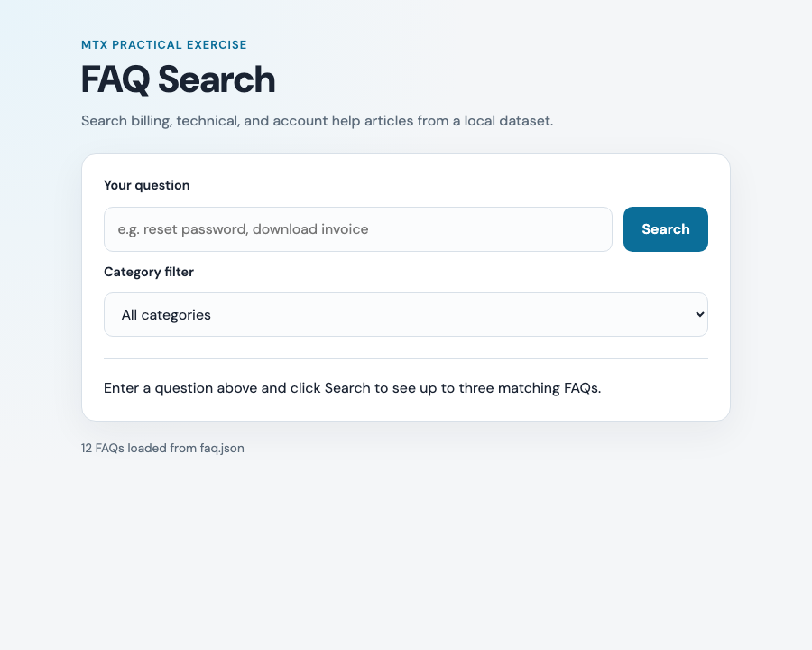
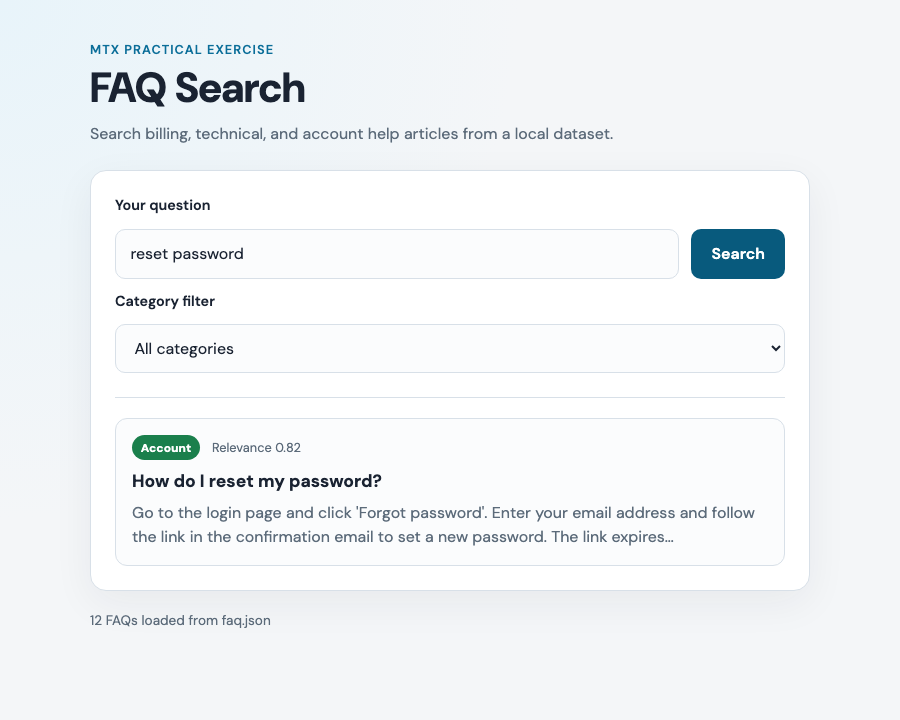
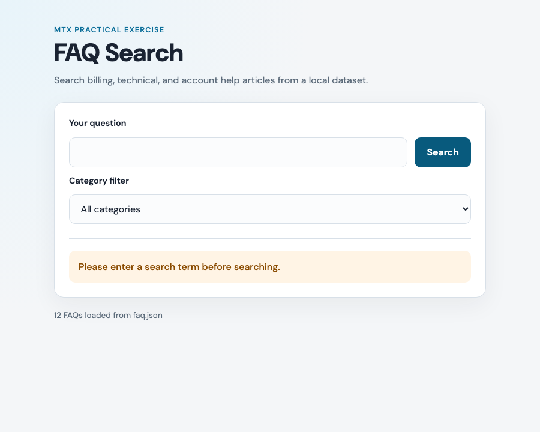
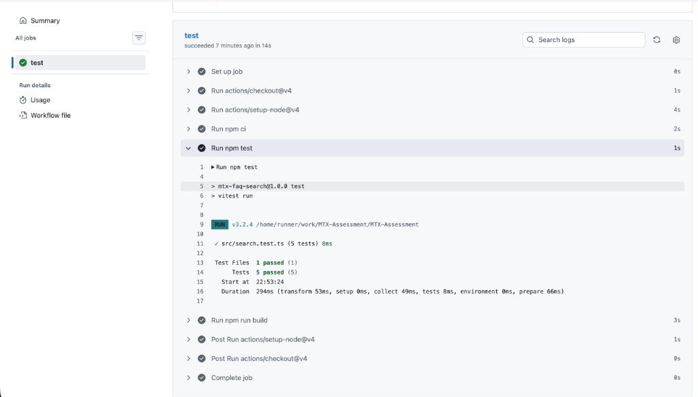

# MTX FAQ Search

Practical exercise submission: a single-page FAQ search prototype for the MTX Junior Associate Consultant role. Users type a question, submit the form, and see up to three ranked matches from a local `faq.json` dataset—no backend server, paid APIs, or LLM required.

---

## What this application does

**MTX FAQ Search** is a React web app that:

1. Loads **12 FAQ entries** from `faq.json` (Billing, Technical, and Account topics).
2. Accepts a **search query** and optional **category filter** (All, Billing, Technical, Account).
3. **Ranks** FAQs by relevance using TF-IDF cosine similarity in the browser.
4. Displays the **top 3** matches with question, answer preview, category badge, and relevance score.
5. Shows clear messages when the query is **empty** or when **no FAQs match**.

Search runs entirely client-side after the page loads. There is no login, database, or external search API.

---

## Screenshots

Image files live in [`docs/screenshots/`](./docs/screenshots/). Click a link below if images do not show in preview.

### 1. Initial page (before search)

<p align="center">
  
</p>

- **Image file:** [docs/screenshots/empty-state.png](./docs/screenshots/empty-state.png)

### 2. Search with results (`reset password`)

<p align="center">
  
</p>

- **Image file:** [docs/screenshots/search-results.png](./docs/screenshots/search-results.png)

### 3. Empty query validation (bonus)

<p align="center">
  
</p>

- **Image file:** [docs/screenshots/empty-query-validation.png](./docs/screenshots/empty-query-validation.png)

### 4. GitHub Actions — tests ran in CI (for reviewers)

<p align="center">
  
</p>

- **Image file:** [docs/screenshots/github-actions-tests.png](./docs/screenshots/github-actions-tests.png)

---

## Prerequisites

Install these **before** you run the app. Nothing else (no Docker, database, or API keys) is required.

| Requirement | Details |
|-------------|---------|
| **Node.js** | Version **18 or newer** (20 LTS recommended). Download: [https://nodejs.org/](https://nodejs.org/) |
| **npm** | Comes with Node.js (used to install packages and run scripts) |
| **Git** | Only needed to clone the repository ([https://git-scm.com/](https://git-scm.com/)) |
| **Web browser** | Chrome, Firefox, Safari, or Edge — to open the app |

**You do not need:** Python, Java, Docker, PostgreSQL, paid API keys, or a cloud account.

### Check that Node and npm are installed

Open a terminal (Terminal on Mac, PowerShell or Command Prompt on Windows) and run:

```bash
node -v    # should print v18.x.x or higher (e.g. v20.x.x)
npm -v     # should print 9.x.x or higher
```

If `node` is not found, install Node.js from [nodejs.org](https://nodejs.org/) and restart the terminal.

### Supported operating systems

macOS, Windows, and Linux are all supported.

---

## Install and run the application (step-by-step)

Follow these steps **from a fresh checkout** of this repository.

### Step 1 — Get the code

**Option A — Clone from GitHub (after the repo is published):**

```bash
git clone https://github.com/MANISHRAJCLOUDIT/MTX-Assessment.git
cd MTX-Assessment
```

**Option B — You already have the folder locally:**

```bash
cd "/path/to/MTX Project"
```

> **Note:** If your folder path contains spaces (e.g. `MTX Project`), keep the quotes around the path as shown above.

### Step 2 — Install dependencies

From the **project root** (the folder that contains `package.json` and `faq.json`):

```bash
npm install
```

- First run may take 1–2 minutes.
- Creates a `node_modules/` folder (listed in `.gitignore`; do not commit it).
- Uses `package-lock.json` for consistent dependency versions.

**Alternative (matches CI exactly):**

```bash
npm ci
```

Use `npm ci` only if `package-lock.json` is present (it is in this repo).

### Step 3 — Start the development server

```bash
npm run dev
```

You should see output similar to:

```text
  VITE v6.x.x  ready in xxx ms

  ➜  Local:   http://localhost:5173/
```

### Step 4 — Open the app in your browser

1. Copy the **Local** URL from the terminal (usually **http://localhost:5173**).
2. Paste it into your browser’s address bar.
3. You should see the **FAQ Search** page with a search box and category dropdown.

### Step 5 — Try a search

1. Type `reset password` in the search box.
2. Click **Search**.
3. You should see up to **3** FAQ results with question, answer preview, and category.

### Step 6 — Stop the server

In the terminal where `npm run dev` is running, press:

**`Ctrl + C`** (Mac/Windows/Linux)

---

## Verify everything works (optional)

From the project root, in a **new** terminal window:

```bash
npm test
```

Expected: all tests pass (5 tests in `src/search.test.ts`).

---

## Troubleshooting

| Problem | What to try |
|---------|-------------|
| `command not found: node` or `npm` | Install Node.js 18+ and restart the terminal |
| `npm install` errors | Delete `node_modules` and run `npm install` again; ensure you are in the project root |
| Port 5173 already in use | Stop the other dev server, or run `npm run dev -- --port 5174` and open `http://localhost:5174` |
| Blank page in browser | Confirm the terminal still shows Vite running; use the exact URL from the terminal |
| Tests fail | Run `npm install` again, then `npm test` from the project root |

---

## All npm commands

| Command | Purpose |
|---------|---------|
| `npm install` | Install dependencies |
| `npm run dev` | Start dev server (local testing) |
| `npm run build` | Type-check and build for production |
| `npm run preview` | Serve the production build locally |
| `npm test` | Run automated search-logic tests |
| `npm run test:watch` | Run tests in watch mode |

### Production build (optional)

```bash
npm run build
npm run preview
```

Then open **http://localhost:4173** (default preview port).

---

## How to run tests

Automated tests cover **search logic only** (not browser E2E), as required by the exercise:

```bash
npm test
```

Expected output: all tests in `src/search.test.ts` pass (matching, empty query, no results, max 3 results, category filter).

Continuous integration: pushing to GitHub runs the same tests plus a production build via [`.github/workflows/test.yml`](.github/workflows/test.yml).

### Verify tests in GitHub Actions (for reviewers)

Reviewers can confirm that automated tests **ran in CI** (not only that the workflow succeeded) by opening the job log and expanding the test step:

1. Open the repository on GitHub → **Actions** tab.
2. In the left sidebar, click **Tests** (workflow from [`.github/workflows/test.yml`](.github/workflows/test.yml)).
3. Open the latest successful run (e.g. on `main`).
4. Click the **test** job.
5. **Expand the step named `Run npm test`** — this is where Vitest runs.
6. In the log, confirm **5 tests passed** in `src/search.test.ts` (e.g. `Tests  5 passed (5)`).

The green check on the workflow means the job passed; expanding **`Run npm test`** shows the actual test output. The step **`Run npm run build`** is a separate TypeScript + Vite build check, not the unit tests.

See [screenshot 4](#4-github-actions--tests-ran-in-ci-for-reviewers) for an example of the expanded step.

---

## Try these sample queries

Use these in the search box to verify behavior:

| Query | What you should see |
|-------|---------------------|
| `reset password` | Account FAQ about password reset (highest relevance) |
| `billing` | Billing FAQs (invoice, charges, payment methods) |
| `503 error` | Technical FAQ about API 503 errors |
| *(empty or spaces only)* | Warning: “Please enter a search term before searching.” |
| `zzzznotarealquery123` | “No results found…” message |

With **Category filter** set to Billing, search `invoice` to see only Billing-category results.

---

## Search approach (ranking)

Ranking is implemented in [`src/search.ts`](src/search.ts):

1. **Tokenize** — Lowercase, remove punctuation, drop common stop words.
2. **Index** — Each FAQ is represented by question + answer + category text.
3. **TF-IDF + cosine similarity** — Compare the query vector to each FAQ vector in the (filtered) corpus.
4. **Boosts** — Higher score if the full query appears in text, tokens appear in the question, or a token matches a category name (e.g. `billing`).
5. **Top 3** — Sort by score descending; return at most three results above a minimum threshold.

No OpenAI, Pinecone, or other paid services are used.

---

## Project structure

```
MTX Project/
├── faq.json                 # 12 FAQ items (id, question, answer, category)
├── docs/screenshots/        # README screenshots
├── src/
│   ├── App.tsx              # React UI (form, results, validation messages)
│   ├── search.ts            # Search and ranking logic
│   ├── search.test.ts       # Vitest unit tests
│   ├── types.ts             # TypeScript types
│   ├── main.tsx             # App entry point
│   └── index.css            # Styles
├── index.html
├── package.json
├── vite.config.ts
└── .github/workflows/test.yml
```

### FAQ data (`faq.json`)

Each item includes:

- `id` — unique identifier (e.g. `faq-001`)
- `question` — user-facing question
- `answer` — full answer text
- `category` — one of: **Billing**, **Technical**, **Account**

---

## Known limitations

- **Keyword/statistical search only** — no semantic embeddings or chatbot answers.
- **No REST API** — search runs in the browser (optional nice-to-have not implemented).
- **No authentication**, admin panel, cloud deployment, Docker, or Kubernetes.
- **Answer preview** truncates long answers in the UI; full text is still used for ranking.
- **FAQ data is static** — bundled `faq.json`, not scraped or edited in-app.

---

## How I would upgrade this to embeddings / RAG

- Precompute **embeddings** for each FAQ and store them in a small vector index.
- On search, retrieve top-k by **cosine similarity** on embeddings (optionally hybrid with TF-IDF).
- Use **RAG** with an LLM only to summarize retrieved FAQs with citations—not as the primary search engine.
- Add **reindexing**, **recall@k** evaluation, and a thin `POST /api/search` if exposing a backend.

---

## Submitting this exercise

1. Push this folder to a **public GitHub repository**.
2. Confirm **Actions** passes (`npm test` + `npm run build`). Reviewers can verify tests ran by following [Verify tests in GitHub Actions (for reviewers)](#verify-tests-in-github-actions-for-reviewers).
3. Reply to the recruitment email with your **GitHub repository URL**.

---

## Hours spent

Approximately **2–3 hours** (application, tests, documentation, and screenshots).

---

## Implementation summary (for reviewers)

This section maps the **MTX Junior Associate Consultant practical exercise** email requirements to what is in this repository.

### Must have — required deliverables

| Email requirement | Implemented? | Where to find it |
|-------------------|--------------|------------------|
| `faq.json` with ≥10 items (`id`, `question`, `answer`, `category`) | Yes | [`faq.json`](faq.json) — 12 items; categories: Billing, Technical, Account |
| Single-page web UI | Yes | [`src/App.tsx`](src/App.tsx) |
| Text input for user query | Yes | `#query` input in `App.tsx` |
| Submit search (button / form) | Yes | Form with **Search** button |
| Results area — up to 3 matches | Yes | [`src/search.ts`](src/search.ts) — `MAX_RESULTS = 3` |
| Each result: question, answer (preview), category | Yes | Result cards in `App.tsx`; preview via `previewAnswer()` |
| Clear message when no good matches | Yes | `NO_RESULTS_MESSAGE` in `search.ts` / UI |
| Rank FAQs by relevance; show top 3 | Yes | TF-IDF + cosine similarity in [`src/search.ts`](src/search.ts) |
| Simple matching (no paid APIs) | Yes | Client-side only; no OpenAI / Pinecone |
| Empty or whitespace-only query — message, no search | Yes | `empty_query` status + warning in UI |
| ≥2 automated tests on **search logic** | Yes | [`src/search.test.ts`](src/search.test.ts) — 5 tests; run: `npm test` |
| Public GitHub repo with source | **You push** | Clone this repo after publish |
| README: overview | Yes | Top of this file |
| README: how to run | Yes | [Quick start](#quick-start-run-the-application) |
| README: how to run tests | Yes | [How to run tests](#how-to-run-tests) — `npm test` |
| README: search approach | Yes | [Search approach](#search-approach-ranking) |
| README: ≥2 screenshots | Yes | [Screenshots](#screenshots) — `docs/screenshots/` |
| README: sample queries | Yes | [Try these sample queries](#try-these-sample-queries) |
| README: known limitations | Yes | [Known limitations](#known-limitations) |
| README: hours spent | Yes | [Hours spent](#hours-spent) |

### Nice to have — optional (included where noted)

| Email item | Status | Notes |
|------------|--------|--------|
| Filter FAQs by category (dropdown) | Done | Category `<select>` in `App.tsx` |
| README: “How I would upgrade to embeddings / RAG” | Done | [RAG section](#how-i-would-upgrade-this-to-embeddings--rag) |
| Thin REST API (`POST /api/search`) | Not built | Search runs in browser only |
| GitHub Actions — tests on push | Done | [`.github/workflows/test.yml`](.github/workflows/test.yml) runs `npm ci`, `npm test`, `npm run build`; reviewers expand **`Run npm test`** — [screenshot](#4-github-actions--tests-ran-in-ci-for-reviewers) |

### Out of scope — intentionally not built

| Email “do not build” | Status |
|----------------------|--------|
| User login, OAuth, JWT | Not included |
| Live LLM / streaming chatbot | Not included |
| Vector databases, cloud deploy, Docker, Kubernetes | Not included |
| Web scraping for FAQ data | Not included — uses bundled `faq.json` |
| Multi-page UI, admin panels, design system | Not included |
| API keys / secrets in repo | Not included |

### Tech stack (this submission)

| Layer | Choice |
|-------|--------|
| UI | React 19 + TypeScript + Vite |
| Search | Custom TF-IDF / cosine similarity ([`src/search.ts`](src/search.ts)) |
| Tests | Vitest ([`src/search.test.ts`](src/search.test.ts)) |
| CI | GitHub Actions ([`.github/workflows/test.yml`](.github/workflows/test.yml)) |

### Quick reviewer commands

Full step-by-step setup: [Install and run the application](#install-and-run-the-application-step-by-step).

```bash
git clone https://github.com/MANISHRAJCLOUDIT/MTX-Assessment.git
cd MTX-Assessment
npm install
npm test          # search logic tests
npm run dev       # open http://localhost:5173 in browser
npm run build     # production build check (also runs in CI)
```

---

## License

Submitted as a practical exercise for MTX Group.
